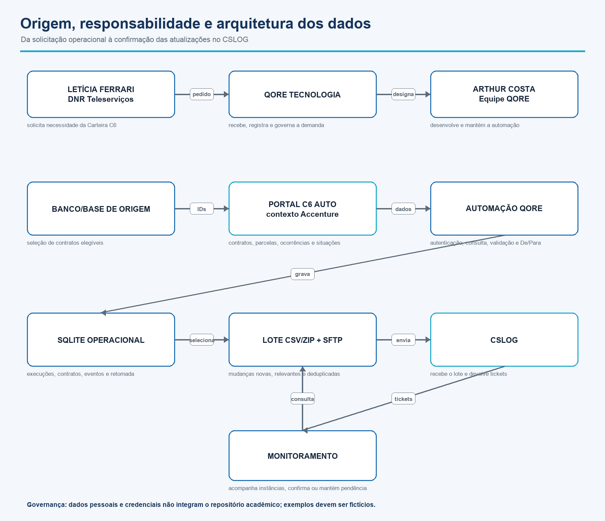
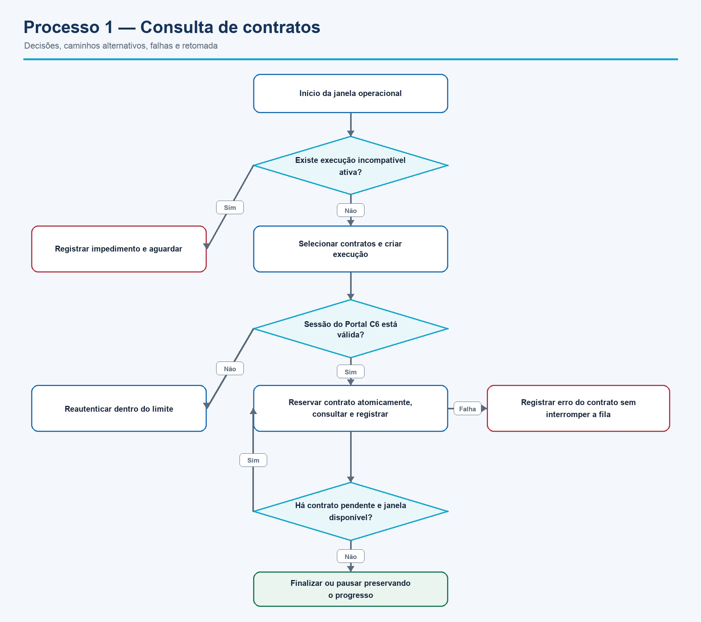
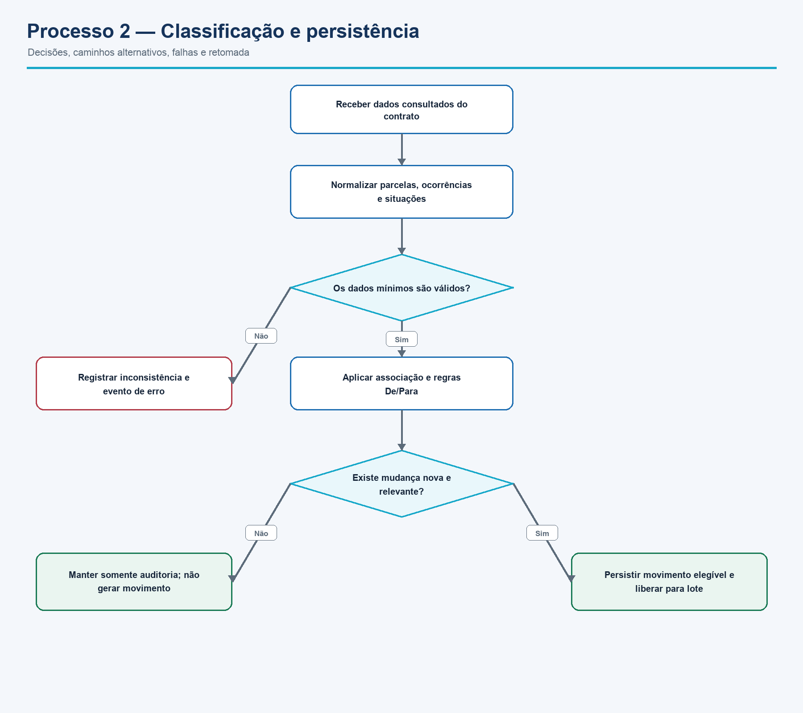
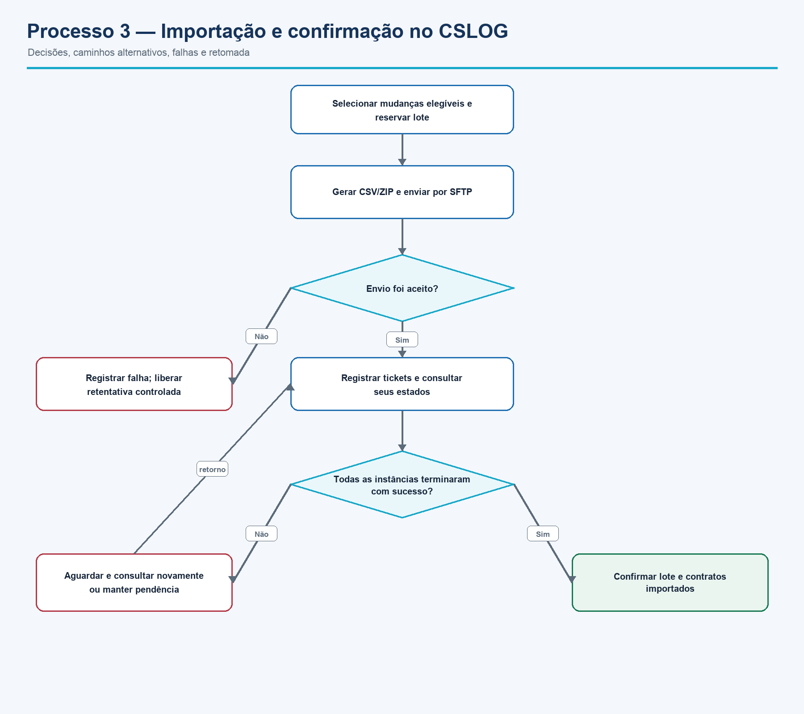
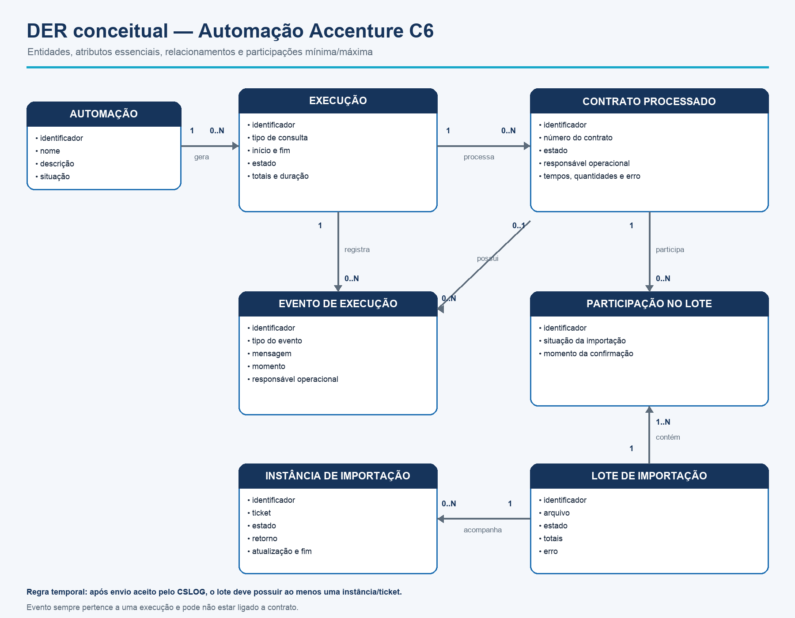
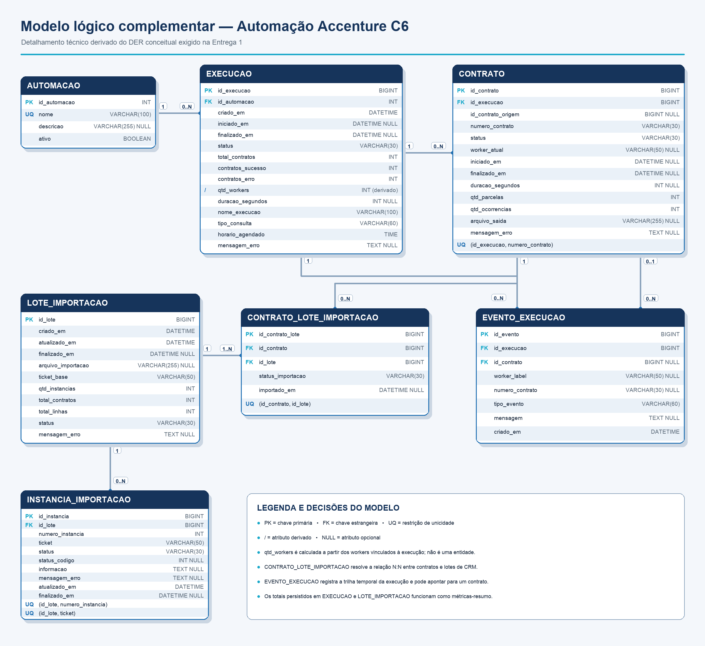

# Entrega 1 — Modelo Conceitual (DER)

| Informação | Identificação |
|---|---|
| Instituição | Universidade Cidade de São Paulo — UNICID |
| Curso | Ciência da Computação |
| Disciplina | Modelagem de Banco de Dados |
| Professor | Cid Rodrigues |
| Local e ano | São Paulo — SP, 2026 |

## Integrantes

| Integrante | RGM |
|---|---:|
| Arthur Costa | 46677259 |
| Felipe Pereira Vescia | 46825576 |
| Roginer Haiz dos Santos | 47632160 |

---

# Título

## Modelagem de Banco de Dados para Monitoramento da Automação Accenture C6 na QORE Tecnologia

## Introdução

### Problema

A operação estudada consulta contratos da base C6 no Portal C6 Auto, interpreta parcelas e ocorrências, aplica regras de classificação e envia ao CSLOG apenas mudanças relevantes. Sem controle estruturado, o trabalho fica sujeito a consulta manual contrato por contrato, duplicidade de movimentos, perda do ponto de retomada, dificuldade de identificar falhas e ausência de rastreabilidade entre consulta, contrato e lote importado.

### Objetivo geral

Modelar conceitualmente um banco de dados capaz de registrar e acompanhar a execução da automação Accenture C6, seus contratos, eventos operacionais e o ciclo de importação das atualizações destinadas ao CSLOG.

### Objetivos específicos

- compreender o processo real por meio de pesquisa de campo, código-fonte e documentação operacional;
- identificar requisitos funcionais, requisitos não funcionais e regras de negócio;
- reconhecer entidades, atributos, relacionamentos e cardinalidades;
- manter rastreabilidade entre execução, contrato, evento e lote importado;
- representar o modelo em um Diagrama Entidade-Relacionamento;
- justificar as decisões de inclusão, exclusão e abstração adotadas.

### Delimitação

O modelo representa o **monitoramento da consulta de contratos e o acompanhamento da importação no CSLOG**. Ele não modela o domínio financeiro completo do C6, o cadastro de clientes, a composição detalhada de parcelas nem o conteúdo de cada linha enviada ao CRM. `PARCELA`, `OCORRENCIA`, `WORKER`, `PROCESSAMENTO_CONTRATO` e `MOVIMENTO_CSLOG` foram avaliados, mas ficaram fora do recorte final pelas razões apresentadas na justificativa técnica.

A Entrega 1 permanece centrada no **modelo conceitual solicitado pelo professor**. Para explicar a origem e a integração dos dados com maior precisão, o trabalho inclui também um diagrama de arquitetura e um modelo lógico preliminar complementar. Esses artefatos aprofundam a análise, mas não substituem o DER conceitual avaliado.

---

## Desenvolvimento

### Caracterização da Organização

#### Nome e natureza da organização

A organização escolhida foi a **QORE Tecnologia**, empresa privada brasileira do setor de tecnologia da informação. A empresa atua com infraestrutura de TI, automação de processos, desenvolvimento de sistemas, suporte técnico, telecomunicações, analytics, Control Desk e segurança da informação.

#### Contexto e porte

A QORE está sediada em São Caetano do Sul, São Paulo. A página institucional da empresa no LinkedIn informa porte de **11 a 50 funcionários**. A operação analisada envolve desenvolvimento, liderança técnica, automação, integração de sistemas, monitoramento e tratamento de dados operacionais.

No processo Accenture C6, a automação é configurada para trabalhar com um Terminal 0 coordenador e até 51 workers de processamento. As execuções ocorrem em janelas recorrentes durante a semana e o fim de semana, processando filas de contratos e lotes de importação com múltiplos tickets.

#### Problemas e necessidades identificados

O processo precisa resolver cinco dificuldades operacionais principais:

1. consultar grande quantidade de contratos sem depender de leitura manual individual;
2. aplicar a mesma interpretação para ocorrências, parcelas e situações do portal;
3. evitar que o mesmo contrato ou movimento seja processado mais de uma vez;
4. preservar o progresso quando uma execução é pausada ou interrompida;
5. acompanhar o lote até a conclusão de todos os tickets gerados pelo CSLOG.

A necessidade central não é apenas armazenar resultados finais. A organização precisa saber **qual automação executou, quando executou, quais contratos participaram, o que ocorreu durante o processamento e em qual lote cada contrato foi importado**.

#### Origem da solicitação e responsabilidades

Segundo o levantamento de campo informado pelo responsável técnico, a necessidade foi apresentada por **Letícia Ferrari**, Gerente Executiva da Carteira C6 e funcionária da **DNR Teleserviços**, cliente da QORE. A QORE recebeu e registrou a solicitação e designou **Arthur Costa**, integrante de sua equipe, como responsável pelo desenvolvimento da automação.

Essa cadeia distingue três papéis que não devem ser confundidos:

| Papel | Participante | Responsabilidade no projeto |
|---|---|---|
| Solicitante operacional | Letícia Ferrari — DNR Teleserviços | Apresentar a necessidade relacionada à Carteira C6. |
| Organização executora | QORE Tecnologia | Receber, registrar, desenvolver e acompanhar a solução. |
| Responsável técnico | Arthur Costa — QORE | Desenvolver a automação e estruturar seu controle de dados. |
| Sistema de origem | Portal C6 Auto utilizado no contexto da operação Accenture | Disponibilizar contratos, parcelas, ocorrências, pagamentos, fases e situações para consulta. |
| Sistema de destino | CSLOG | Receber mudanças classificadas e devolver tickets de acompanhamento. |

O trabalho não afirma vínculo contratual direto da Accenture com a QORE. No recorte documentado, “Accenture C6” identifica o contexto operacional e o portal consultado; a solicitação descrita partiu da representante da DNR Teleserviços.

#### Justificativa da escolha

A QORE foi escolhida porque é uma organização real, acessível ao grupo e possui um processo com complexidade adequada à disciplina. O caso apresenta múltiplas entidades, regras de seleção, concorrência entre workers, estados de execução, tratamento de erros, relacionamento muitos-para-muitos e integração com sistema externo. Ao mesmo tempo, o recorte pode ser delimitado sem tentar modelar todo o domínio financeiro ou todos os sistemas da operação.

#### Contexto do caso e termos utilizados

- **Accenture C6:** nome adotado neste trabalho para a automação executada pela QORE no processo de consulta e acompanhamento de contratos da operação Accenture vinculada ao C6. A automação acessa o Portal C6 Auto, organiza filas, consulta contratos e prepara mudanças relevantes para a etapa de importação.
- **Portal C6 Auto:** sistema de origem consultado pela automação. Nele ficam as informações de contratos, parcelas, ocorrências, pagamentos, fases e situações usadas na classificação operacional.
- **CSLOG:** sistema de destino que recebe, por importação, as atualizações produzidas após a consulta e a classificação. No recorte acadêmico, ele é tratado como um sistema externo; seu banco interno não faz parte do modelo.
- **Ticket:** protocolo devolvido pelo CSLOG para acompanhar uma importação. Um mesmo lote pode gerar mais de um ticket, motivo pelo qual o modelo possui a entidade `INSTANCIA_IMPORTACAO`.
- **Worker:** unidade paralela de processamento que reserva e consulta contratos. Os workers aumentam a capacidade da execução, mas não possuem cadastro ou ciclo de vida próprio no recorte conceitual.
- **Heartbeat:** sinal periódico de atividade de um worker. A ausência do sinal dentro do limite permite identificar uma unidade inativa e devolver o contrato à fila com segurança.
- **De/Para:** conjunto de regras que traduz situações, ocorrências e estados encontrados no portal para a classificação operacional esperada no processo.

#### Origem e linhagem dos dados

| Etapa | Origem | Dados utilizados | Transformação ou controle | Destino |
|---|---|---|---|---|
| Formação da fila | Banco/base operacional de origem | Identificadores de contratos elegíveis e critérios da fila | Prioridade, fase, situação e exclusão entre filas | `EXECUCAO` e `CONTRATO` no SQLite |
| Consulta | Portal C6 Auto | Contrato, parcelas, ocorrências, pagamentos, fases e situações | Autenticação, validação da resposta e normalização | Contexto operacional do contrato |
| Classificação | Dados normalizados da consulta | Estados e ocorrências associados às parcelas | Regras De/Para e identificação de mudança funcional | Resultado do contrato e eventos de auditoria |
| Persistência | Automação QORE | Estados, tempos, contagens, mensagens e decisões | Unicidade, reserva atômica, heartbeat e retomada | SQLite operacional |
| Preparação da integração | Mudanças elegíveis persistidas | Contratos e movimentos ainda não confirmados | Deduplicação, reserva do lote e geração de CSV/ZIP | Arquivo de importação |
| Envio | Arquivo CSV/ZIP | Mudanças classificadas | Transferência SFTP e validação do retorno | CSLOG |
| Acompanhamento | CSLOG | Ticket-base, instâncias, estados e mensagens | Consulta periódica até estado terminal | `LOTE_IMPORTACAO` e `INSTANCIA_IMPORTACAO` |

Os dados operacionais são originados nos sistemas externos; o banco proposto registra a execução, a rastreabilidade e o resultado da transformação. Ele não se apresenta como fonte mestre dos contratos do Banco C6.

#### Evidências da organização e da pesquisa de campo

- **Site institucional:** [QORE Tecnologia](https://www.qoretecnologia.com.br/)
- **LinkedIn institucional:** [QORE Tecnologia](https://br.linkedin.com/company/titectecnologia)
- **Endereço divulgado no site oficial:** R. Niterói, 62 — São Caetano do Sul, SP.
- **Telefone divulgado:** (11) 4081-5292.
- **E-mail divulgado:** contato@qoretecnologia.com.br.
- **Responsável consultado:** Leonardo Queiroz — CEO.
- **Participantes da consulta:** Leonardo Queiroz — CEO; Renan Medeiros — Tech Lead; Arthur Costa — Dev.
- **Forma de pesquisa:** reunião remota, observação do processo, leitura da documentação, inspeção de código e análise controlada do banco local.

> A fotografia é utilizada exclusivamente como evidência acadêmica da empresa consultada e das pessoas que participaram do levantamento.

---

### Processos de Negócio

#### Principais processos mapeados

| Processo | Entrada | Atividades principais | Saída |
|---|---|---|---|
| Consulta de contratos | Tipo de fila, janela, limite, workers e contratos elegíveis | Seleção, autenticação, reserva, consulta e registro | Contratos finalizados, erros, métricas e eventos |
| Classificação e persistência | Parcelas, ocorrências, pagamentos, fases e situações | Normalização, associação ocorrência-parcela, De/Para e deduplicação | Status operacional, auditoria e movimento elegível |
| Importação no CSLOG | Movimentos pendentes e contratos associados | Reserva do lote, geração de CSV/ZIP, envio SFTP e consulta de tickets | Lote concluído ou erro recuperável |
| Monitoramento e retomada | Estados persistidos, heartbeats e eventos | Cálculo de totais, detecção de worker inativo e retomada | Visibilidade operacional sem repetir concluídos |

#### Agendamento operacional confirmado

| Período | Início | Sequência de consultas | Limite ou condição |
|---|---:|---|---|
| Segunda a sexta-feira | 22:00 | Prioritários com status 6–8 → ativos nas fases 0–4 → devolvidos nas fases 0–4 | 07:00 do dia seguinte |
| Segunda a sexta-feira | 07:00 | Cadastrados no dia → retornos com histórico de código 245 no dia | Até concluir |
| Sábado | 14:20 | Prioritários com status 6–8 → contratos com fase maior que 4 | Segunda-feira às 07:00 |
| Domingo | 00:00 | Somente prioritários com status 6–8 | Executa apenas se o ciclo de sábado tiver terminado |

Ao atingir um horário-limite, a execução é pausada de forma controlada: resultados concluídos são preservados e itens ainda em processamento podem retornar a `PENDENTE`. O agendador também inicia o importador CSLOG e impede sobreposição operacional incompatível.

#### Fluxograma 1 — Consulta de contratos

O fluxo explicita bloqueio por execução incompatível, autenticação, reserva atômica, erro isolado e a decisão entre continuar a fila ou pausar/finalizar.

#### Fluxograma 2 — Classificação e persistência

O fluxo separa dado inválido, auditoria sem movimento e persistência de uma mudança nova e relevante. Assim, ausência de mudança não é tratada como erro.

#### Fluxograma 3 — Importação no CSLOG

O fluxo diferencia falha de envio, acompanhamento ainda pendente e confirmação integral. Um lote não é concluído enquanto suas instâncias não atingirem o resultado esperado.

#### Integração entre os processos

A consulta produz os dados necessários à classificação. A classificação aplica as regras De/Para e registra o histórico operacional. Somente mudanças novas e relevantes tornam-se elegíveis para importação. A importação agrupa os contratos em lotes, envia o arquivo e acompanha cada ticket. O monitoramento utiliza os registros de todas essas etapas para apresentar progresso e permitir retomada segura.

---

### Proposta de Solução

#### Visão geral

Propõe-se uma solução de monitoramento e persistência centrada em **rastreabilidade ponta a ponta**. O banco não deve funcionar apenas como um depósito de resultados: ele deve representar o ciclo completo desde o disparo da automação até a confirmação da importação no CSLOG. Dessa forma, cada execução pode responder objetivamente às perguntas: qual processo foi iniciado, quais contratos entraram na fila, quem os processou, quais eventos ocorreram, o que foi importado, quais tickets foram gerados e onde aconteceu uma eventual falha.

A proposta mantém a automação existente como fonte do comportamento operacional e organiza os dados em sete entidades conceituais. Ela não substitui o Portal C6 Auto nem o CSLOG. Sua função é criar uma camada confiável de controle entre esses sistemas, reduzindo duplicidade, perda de progresso e dificuldade de auditoria.

#### Componentes lógicos da solução

| Componente | Responsabilidade | Dados principais envolvidos |
|---|---|---|
| Cadastro da automação | Identificar e descrever o processo monitorado. | `AUTOMACAO` |
| Orquestração e agendamento | Abrir execuções nas janelas definidas, impedir sobreposição incompatível e aplicar horários-limite. | `EXECUCAO` |
| Processamento de contratos | Selecionar, reservar, consultar, classificar e finalizar cada item da fila. | `CONTRATO` |
| Auditoria operacional | Registrar mudanças de estado, heartbeats, retomadas, erros e decisões relevantes. | `EVENTO_EXECUCAO` |
| Gestão de importação | Agrupar contratos elegíveis, controlar o envio ao CSLOG e consolidar o resultado. | `LOTE_IMPORTACAO` e `CONTRATO_LOTE_IMPORTACAO` |
| Acompanhamento externo | Registrar cada ticket devolvido pelo CSLOG até seu encerramento. | `INSTANCIA_IMPORTACAO` |
| Monitoramento | Calcular indicadores a partir das entidades, sem criar uma entidade genérica e redundante de métricas. | Consultas sobre execução, contrato, evento e lote |

#### Fluxo de dados proposto

| Etapa | Entrada | Validação e regra aplicada | Persistência | Saída observável |
|---|---|---|---|---|
| 1. Disparo | Data, horário, tipo de consulta e configuração operacional | Verificar janela, ciclo anterior e ausência de execução incompatível | Criar `EXECUCAO` vinculada a `AUTOMACAO` | Execução identificada e auditável |
| 2. Formação da fila | Contratos elegíveis no banco de origem | Aplicar prioridade, fase, situação e exclusão entre filas | Criar `CONTRATO` único dentro da execução | Total da fila e itens pendentes |
| 3. Reserva | Contrato em `PENDENTE` e worker disponível | Reservar atomicamente somente um item por worker | Atualizar contrato para `PROCESSANDO` e registrar evento | Responsável e horário conhecidos |
| 4. Consulta | Sessão autenticada e número do contrato | Validar retorno, parcelas, ocorrências e consistência mínima | Atualizar quantidades, tempos e contexto do contrato | Dados prontos para classificação |
| 5. Classificação | Dados normalizados do portal | Aplicar associação ocorrência-parcela e regras De/Para | Registrar resultado e eventos relevantes | Sucesso, erro ou mudança elegível |
| 6. Seleção para importação | Mudanças funcionais produzidas | Remover conteúdo repetido e ignorar estado sem mudança relevante | Associar contratos ao lote | Conjunto idempotente para envio |
| 7. Envio ao CSLOG | Lote reservado, arquivo gerado e conexão autorizada | Garantir exclusividade da importação e validar retorno do envio | Atualizar `LOTE_IMPORTACAO` | Ticket-base e quantidade enviada |
| 8. Acompanhamento | Ticket-base e instâncias descobertas | Consultar até que todas as instâncias válidas terminem | Atualizar `INSTANCIA_IMPORTACAO` | Lote concluído ou erro recuperável |
| 9. Encerramento | Estados finais dos contratos e tickets | Conferir totais e integridade referencial | Finalizar execução e lote | Histórico completo para relatório |

#### Ciclos de vida controlados

Os estados não são apenas rótulos de tela: eles determinam quais transições são permitidas e como o processo pode ser recuperado.

| Objeto | Ciclo de vida proposto | Controle principal |
|---|---|---|
| Execução | criada → rodando → pausada ou finalizada; erro somente para interrupção técnica geral | Execução pausada conserva concluídos e pode retomar no mesmo identificador. |
| Contrato | pendente → processando → sucesso ou erro | Contrato sem heartbeat válido pode retornar a pendente; sucesso não volta automaticamente à fila. |
| Lote | processando → concluído ou erro | Apenas um lote pode permanecer com reserva de envio ativa. |
| Instância | aguardando → em processamento → concluída ou erro | O lote só é confirmado quando todas as instâncias existentes alcançam estado terminal válido. |

#### Integridade, concorrência e idempotência

Para evitar inconsistências, a proposta combina regras do banco com transações da aplicação:

1. `CONTRATO` deve ser único por `id_execucao + numero_contrato`;
2. a passagem de `PENDENTE` para `PROCESSANDO` deve ocorrer em transação atômica, impedindo dois workers de reservar o mesmo item;
3. `CONTRATO_LOTE_IMPORTACAO` deve ser único por `id_contrato + id_lote`;
4. cada número de instância e cada ticket devem ser únicos dentro do lote;
5. chaves estrangeiras devem impedir contratos, eventos, associações e instâncias órfãos;
6. a seleção para importação deve comparar o conteúdo funcional já confirmado, impedindo o reenvio de uma atualização idêntica;
7. contadores consolidados devem ser recalculáveis a partir dos registros detalhados, permitindo detectar divergências.

Essas medidas tratam dois riscos centrais do processo: **concorrência**, causada pelo uso de vários workers, e **repetição**, causada por retomadas, retentativas ou reenvio de lotes.

#### Tratamento de falhas e recuperação

| Falha | Resposta proposta | Evidência preservada |
|---|---|---|
| Sessão expirada no Portal C6 Auto | Refazer autenticação dentro do limite de tentativa e registrar o evento. | Tipo do evento, horário, worker e contrato afetado |
| Worker sem heartbeat | Considerar a reserva abandonada após cinco minutos e devolver o contrato a `PENDENTE`. | Último heartbeat e evento de recuperação |
| Contrato com erro isolado | Finalizar somente o item como `ERRO` e permitir que a execução continue. | Mensagem, duração e contexto do contrato |
| Horário-limite atingido | Pausar a execução, preservar sucessos e liberar itens incompletos para retomada. | Status da execução e sequência de eventos |
| Falha na geração ou envio do lote | Manter contratos sem confirmação e permitir nova tentativa controlada. | Status e mensagem de erro do lote |
| Ticket ainda não concluído | Manter o lote em processamento e consultar novamente, sem confirmar antecipadamente. | Estado individual de cada instância |
| Interrupção geral | Marcar a execução como erro técnico sem apagar o histórico já persistido. | Execução, contratos concluídos e último evento conhecido |

#### Segurança, privacidade e governança

- o repositório acadêmico deve conter apenas estrutura, documentação e imagens sem dados de clientes;
- credenciais, cookies, tokens, perfis de navegador e arquivos de ambiente devem permanecer fora do versionamento;
- números reais de contrato e respostas brutas do portal não devem aparecer no README, DER, fluxogramas ou exemplos públicos;
- mensagens de erro publicadas devem ser sanitizadas para remover dados identificáveis;
- alterações em agenda, De/Para e importação devem atualizar conjuntamente código, testes e documentação;
- acesso ao banco operacional deve seguir o princípio do menor privilégio e ser separado do material acadêmico.

#### Indicadores produzidos pela proposta

Os indicadores são derivados das entidades, evitando duplicação desnecessária:

| Indicador | Origem do cálculo | Finalidade |
|---|---|---|
| Progresso da execução | contratos concluídos ÷ total de contratos | Acompanhar avanço da fila |
| Taxa de sucesso | contratos com sucesso ÷ contratos finalizados | Avaliar estabilidade operacional |
| Tempo médio por contrato | soma das durações ÷ contratos finalizados | Identificar degradação de processamento |
| Workers ativos | último heartbeat por identificação operacional | Detectar capacidade disponível e inatividade |
| Contratos aguardando importação | contratos elegíveis sem associação confirmada | Medir fila de integração |
| Situação do lote | estados das instâncias vinculadas | Impedir confirmação parcial incorreta |
| Erros por etapa | eventos e mensagens agrupados por tipo | Priorizar correções recorrentes |

#### Rastreabilidade entre problema e solução

| Problema observado | Mecanismo proposto | Entidades que comprovam o resultado |
|---|---|---|
| Perda do ponto de retomada | Estados persistidos e retomada no mesmo ciclo | `EXECUCAO`, `CONTRATO` e `EVENTO_EXECUCAO` |
| Contrato reservado mais de uma vez | Unicidade e reserva transacional | `CONTRATO` |
| Falha sem contexto histórico | Eventos cronológicos vinculados à execução e, quando aplicável, ao contrato | `EVENTO_EXECUCAO` |
| Reenvio de atualização idêntica | Seleção idempotente e associação explícita contrato-lote | `CONTRATO_LOTE_IMPORTACAO` |
| Lote confirmado antes de todos os tickets | Acompanhamento individual e regra de conclusão conjunta | `LOTE_IMPORTACAO` e `INSTANCIA_IMPORTACAO` |
| Métricas inconsistentes | Indicadores recalculáveis a partir dos registros detalhados | `EXECUCAO`, `CONTRATO`, `EVENTO_EXECUCAO` e `LOTE_IMPORTACAO` |

#### Evolução planejada

Esta entrega permanece no nível conceitual. A implementação futura deve ocorrer de forma incremental:

1. converter o DER em modelo lógico, definindo tipos, chaves, nulabilidade, domínios de status e índices necessários;
2. criar o esquema físico inicialmente compatível com o SQLite já usado pela automação, preservando o baixo custo operacional;
3. executar migração controlada, com cópia de segurança, validação de totais e possibilidade de retorno;
4. validar concorrência, retomada, deduplicação e integridade com testes automatizados;
5. construir consultas ou painel de acompanhamento sobre o modelo estabilizado;
6. avaliar banco servidor somente se surgirem demanda multiusuário, centralização ou volume que o SQLite local não atenda adequadamente.

A escolha evita introduzir uma arquitetura distribuída sem necessidade comprovada. A solução aprofunda o controle do processo atual e mantém uma trajetória clara de evolução, sem confundir proposta acadêmica com implantação já realizada.

---

### Requisitos do Sistema

#### Requisitos Funcionais

| ID | Requisito funcional |
|---|---|
| RF01 | O sistema deve selecionar contratos conforme a fila operacional solicitada. |
| RF02 | O sistema deve permitir a consulta manual de um contrato para diagnóstico. |
| RF03 | O sistema deve registrar cada execução e os contratos que compõem sua fila. |
| RF04 | O sistema deve autenticar e manter uma sessão válida no Portal C6 Auto. |
| RF05 | O sistema deve distribuir contratos pendentes entre workers sem reserva duplicada. |
| RF06 | O sistema deve consultar dados do contrato, parcelas, ocorrências e detalhes associados. |
| RF07 | O sistema deve relacionar cada ocorrência às parcelas correspondentes. |
| RF08 | O sistema deve aplicar o De/Para e produzir a classificação operacional. |
| RF09 | O sistema deve registrar status, horários, durações, quantidades e erros. |
| RF10 | O sistema deve registrar eventos e heartbeats para monitoramento e auditoria. |
| RF11 | O sistema deve permitir pausar e retomar uma execução sem repetir itens concluídos. |
| RF12 | O sistema deve gerar apenas movimentos CSLOG novos e funcionalmente relevantes. |
| RF13 | O sistema deve reservar, gerar, compactar e enviar lotes de importação. |
| RF14 | O sistema deve acompanhar o ticket-base e as instâncias confirmadas pelo CSLOG. |
| RF15 | O sistema deve confirmar as linhas somente após a conclusão de todos os tickets válidos. |
| RF16 | O sistema deve apresentar monitoramento por execução, contrato, worker e importação. |
| RF17 | O sistema deve registrar como finalizada uma consulta executada sem contratos elegíveis. |
| RF18 | O sistema deve executar automaticamente as janelas operacionais configuradas. |

#### Requisitos Não Funcionais

| ID | Característica e meta | Critério de aceite |
|---|---|---|
| RNF01 | Rastreabilidade: 100% dos contratos, eventos, lotes e instâncias devem possuir vínculo válido com seus registros-pai. | Uma consulta de integridade deve retornar zero registros órfãos e incluir casos de sucesso, erro e retomada. |
| RNF02 | Integridade: cada contrato pode ter no máximo uma reserva ativa e pode existir no máximo uma importação vigente. | Um teste concorrente deve terminar com zero reservas duplicadas e zero importações vigentes simultâneas. |
| RNF03 | Recuperabilidade: uma interrupção deve preservar 100% dos itens concluídos e retomar somente os pendentes no mesmo `id_execucao`. | Após parada controlada e reinício, nenhum concluído pode ser reprocessado e todos os pendentes devem voltar ao fluxo. |
| RNF04 | Resiliência: worker em `PROCESSANDO` sem heartbeat por cinco minutos deve ser substituído; retentativas técnicas devem possuir limite. | A simulação deve devolver o contrato a `PENDENTE`, registrar o evento e encerrar a tentativa ao atingir o limite configurado. |
| RNF05 | Segurança: deve haver zero credenciais, tokens, cookies ou dados autenticados expostos no repositório, logs acadêmicos e relatórios. | A varredura de segredos deve retornar zero achados e os arquivos locais sensíveis devem permanecer fora do versionamento. |
| RNF06 | Capacidade: suportar a configuração operacional de 51 workers mais o Terminal 0 sem duplicar reservas. | Uma execução controlada deve registrar os 51 workers, seus heartbeats e zero contratos processados em duplicidade. |
| RNF07 | Observabilidade: 100% das execuções devem exibir status, totais, horários e erros; inatividade deve ser detectada em até cinco minutos. | Os dados do portal/API devem conferir com o SQLite e todo worker inativo deve ser sinalizado dentro do limite. |
| RNF08 | Consistência documental: 100% das mudanças de agenda, De/Para ou importação devem atualizar código, testes e documentação na mesma entrega. | O checklist da mudança deve apresentar os três artefatos atualizados e nenhuma divergência aberta. |

---

### Regras de Negócio

#### Regras operacionais

| ID | Regra de negócio |
|---|---|
| RN01 | Cada execução possui uma fila e um conjunto próprio de contratos. |
| RN02 | O mesmo contrato não pode aparecer em mais de uma fila operacional do mesmo ciclo. |
| RN03 | Status de parcela 6, 7 ou 8 torna o contrato prioritário, independentemente da fase. |
| RN04 | Consulta vazia deve finalizar normalmente com total zero. |
| RN05 | Cada contrato pendente deve ser reservado atomicamente por somente um worker. |
| RN06 | Uma ocorrência deve ser associada à parcela considerando detalhe, data-base, data de pagamento e tipo. |
| RN07 | `BAIXA MANUAL` pode complementar uma ocorrência anterior compatível; não deve ser interpretada isoladamente. |
| RN08 | Ausência conhecida de ocorrências pode resultar em zero ocorrências sem falhar o contrato. |
| RN09 | Estado `Em aberto`, sem mudança relevante, não gera movimento CSLOG. |
| RN10 | Conteúdo funcional idêntico não deve gerar movimento duplicado. |
| RN11 | Uma mudança efetiva de status ou informação pode gerar novo movimento. |
| RN12 | Estados concluídos permanecem gravados e não são reprocessados automaticamente. |
| RN13 | Ao pausar, itens em processamento podem retornar a `PENDENTE`; sucessos e erros são preservados. |
| RN14 | Somente uma importação CSLOG pode reservar e enviar lote por vez. |
| RN15 | Linhas somente são confirmadas após todas as instâncias de ticket existentes finalizarem. |
| RN16 | Erro individual produz “Finalizado com falhas”; “Erro” geral fica reservado à interrupção técnica. |

#### Restrições organizacionais

- contratos prioritários são excluídos das demais filas do mesmo ciclo;
- o horário-limite deve pausar a execução sem apagar concluídos;
- credenciais, tokens, cookies e perfis autenticados não podem ser publicados;
- respostas brutas e dados identificáveis permanecem apenas no ambiente operacional autorizado;
- a consulta dedicada de acordos não integra o recorte desta entrega;
- a proposta acadêmica não representa uma migração aplicada ao SQLite de produção;
- um lote efetivo deve possuir pelo menos um contrato e uma instância de acompanhamento.

---

### Dicionário de Dados Conceitual (Preliminar)

O dicionário usa o mesmo padrão para todas as entidades. Não são apresentados exemplos com dados reais de clientes ou contratos.

#### Entidade: AUTOMACAO

Identifica o processo automatizado monitorado.

| Atributo | Descrição | Regra de negócio associada |
|---|---|---|
| `id_automacao` | Identificador da automação. | Chave primária obrigatória. |
| `nome` | Nome único do processo automatizado. | Obrigatório e único. |
| `descricao` | Resumo funcional do processo. | Opcional. |
| `ativo` | Indica se a automação está habilitada. | Obrigatório; padrão verdadeiro. |

#### Entidade: EXECUCAO

Representa um ciclo ou fila processada.

| Atributo | Descrição | Regra de negócio associada |
|---|---|---|
| `id_execucao` | Identificador da execução. | Chave primária obrigatória. |
| `id_automacao` | Automação responsável pelo ciclo. | FK obrigatória para `AUTOMACAO`. |
| `criado_em` | Momento da criação do registro. | Obrigatório. |
| `iniciado_em` | Início efetivo do processamento. | Opcional enquanto não iniciada. |
| `finalizado_em` | Término efetivo do ciclo. | Opcional enquanto não encerrada. |
| `status` | Situação geral da execução. | `RODANDO`, `PAUSADA`, `FINALIZADA`, `ENCERRADA` ou `ERRO`. |
| `total_contratos` | Quantidade total da fila. | Obrigatório; padrão zero. |
| `contratos_sucesso` | Quantidade concluída com sucesso. | Obrigatório; padrão zero. |
| `contratos_erro` | Quantidade concluída com falha. | Obrigatório; padrão zero. |
| `qtd_workers` | Quantidade de workers vinculados. | Atributo derivado dos registros operacionais. |
| `duracao_segundos` | Duração total do ciclo. | Calculada após início/fim. |
| `nome_execucao` | Nome legível do ciclo. | Opcional. |
| `tipo_consulta` | Fila ou modo de consulta. | Deve corresponder a uma seleção operacional aceita. |
| `horario_agendado` | Horário previsto para início. | Opcional em consulta manual. |
| `mensagem_erro` | Motivo técnico consolidado. | Preenchido quando houver interrupção geral. |

#### Entidade: CONTRATO

Representa a unidade processada dentro de uma execução.

| Atributo | Descrição | Regra de negócio associada |
|---|---|---|
| `id_contrato` | Identificador interno do contrato monitorado. | Chave primária obrigatória. |
| `id_execucao` | Execução da qual o item participa. | FK obrigatória; compõe a unicidade. |
| `id_contrato_origem` | Identificador técnico no banco de origem. | Opcional. |
| `numero_contrato` | Número do contrato consultado. | Obrigatório; único dentro da execução. |
| `status` | Estado do processamento. | `PENDENTE`, `PROCESSANDO`, `SUCESSO` ou `ERRO`. |
| `worker_atual` | Worker que reservou ou processou o item. | Opcional; não transforma worker em entidade acadêmica. |
| `iniciado_em` | Início da tentativa. | Opcional antes da reserva. |
| `finalizado_em` | Término da tentativa. | Opcional enquanto não concluída. |
| `duracao_segundos` | Duração individual. | Calculada após início/fim. |
| `qtd_parcelas` | Quantidade de parcelas coletadas. | Obrigatório; padrão zero. |
| `qtd_ocorrencias` | Quantidade de ocorrências coletadas. | Obrigatório; padrão zero. |
| `arquivo_saida` | Referência ao resultado local autorizado. | Opcional; não deve expor dado sensível no GitHub. |
| `mensagem_erro` | Erro final do contrato. | Preenchido quando o item falhar. |

#### Entidade: EVENTO_EXECUCAO

Representa a trilha temporal e operacional da execução.

| Atributo | Descrição | Regra de negócio associada |
|---|---|---|
| `id_evento` | Identificador do evento. | Chave primária obrigatória. |
| `id_execucao` | Execução que originou o evento. | FK obrigatória. |
| `id_contrato` | Contrato relacionado ao fato. | FK opcional; nulo para eventos gerais. |
| `worker_label` | Identificador operacional do worker. | Opcional. |
| `numero_contrato` | Número redundante para leitura histórica. | Opcional; não substitui a FK. |
| `tipo_evento` | Código do fato registrado. | Obrigatório e controlado. |
| `mensagem` | Contexto legível do evento. | Opcional. |
| `criado_em` | Momento imutável do evento. | Obrigatório. |

#### Entidade: LOTE_IMPORTACAO

Representa o envio agrupado ao CSLOG.

| Atributo | Descrição | Regra de negócio associada |
|---|---|---|
| `id_lote` | Identificador do lote. | Chave primária obrigatória. |
| `criado_em` | Momento de criação. | Obrigatório. |
| `atualizado_em` | Última atualização do estado. | Obrigatório. |
| `finalizado_em` | Conclusão do lote. | Opcional enquanto em andamento. |
| `arquivo_importacao` | Referência ao CSV/ZIP enviado. | Opcional antes da geração. |
| `ticket_base` | Ticket principal retornado. | Obrigatório após o envio aceito. |
| `qtd_instancias` | Quantidade esperada de tickets. | Obrigatório; mínimo um em lote efetivo. |
| `total_contratos` | Quantidade de contratos distintos. | Obrigatório; mínimo um em lote efetivo. |
| `total_linhas` | Quantidade de linhas enviadas. | Obrigatório. |
| `status` | Estado consolidado do lote. | `PROCESSANDO`, `CONCLUIDO` ou `ERRO`. |
| `mensagem_erro` | Falha consolidada do lote. | Preenchida quando houver erro. |

#### Entidade: INSTANCIA_IMPORTACAO

Representa o acompanhamento individual de cada ticket.

| Atributo | Descrição | Regra de negócio associada |
|---|---|---|
| `id_instancia` | Identificador da instância. | Chave primária obrigatória. |
| `id_lote` | Lote ao qual a instância pertence. | FK obrigatória. |
| `numero_instancia` | Ordem sequencial dentro do lote. | Única dentro do lote. |
| `ticket` | Protocolo devolvido pelo CSLOG. | Único dentro do lote. |
| `status` | Estado textual do acompanhamento. | Obrigatório; inicia em `Aguardando`. |
| `status_codigo` | Código numérico retornado. | Opcional. |
| `informacao` | Mensagem informativa do serviço. | Opcional. |
| `mensagem_erro` | Falha específica da instância. | Opcional. |
| `atualizado_em` | Momento da última consulta. | Obrigatório. |
| `finalizado_em` | Momento da conclusão. | Opcional enquanto não finalizada. |

#### Entidade: CONTRATO_LOTE_IMPORTACAO

Representa a associação entre contratos e lotes.

| Atributo | Descrição | Regra de negócio associada |
|---|---|---|
| `id_contrato_lote` | Identificador da associação. | Chave primária obrigatória. |
| `id_contrato` | Contrato participante. | FK obrigatória; compõe a unicidade. |
| `id_lote` | Lote participante. | FK obrigatória; compõe a unicidade. |
| `status_importacao` | Situação do contrato no lote. | `PENDENTE`, `RESERVADO`, `IMPORTADO` ou `ERRO`. |
| `importado_em` | Momento da confirmação no CSLOG. | Opcional até a importação. |

---

### Modelagem Conceitual (Entidades, Atributos, Relacionamentos)

#### Entidades reconhecidas

| Entidade | Justificativa |
|---|---|
| `AUTOMACAO` | Identifica o processo monitorado e permite que o modelo seja reutilizado para outras automações. |
| `EXECUCAO` | Representa cada ciclo, fila ou janela processada, preservando totais e estado geral. |
| `CONTRATO` | É a unidade de trabalho reservada, consultada e concluída dentro de uma execução. |
| `EVENTO_EXECUCAO` | Registra fatos técnicos e operacionais que não cabem somente no status final. |
| `LOTE_IMPORTACAO` | Representa o envio agrupado ao CSLOG e seus totais consolidados. |
| `INSTANCIA_IMPORTACAO` | Permite acompanhar separadamente cada ticket gerado para o lote. |
| `CONTRATO_LOTE_IMPORTACAO` | Resolve a relação N:N entre contratos processados e lotes importados. |

#### Classificação dos atributos

- **Identificadores:** `id_automacao`, `id_execucao`, `id_contrato`, `id_evento`, `id_lote`, `id_instancia` e `id_contrato_lote`.
- **Descritivos:** `nome`, `descricao`, `nome_execucao`, `tipo_evento`, `mensagem` e `informacao`.
- **Temporais:** `criado_em`, `iniciado_em`, `finalizado_em`, `atualizado_em` e `importado_em`.
- **Operacionais:** `status`, `worker_atual`, `ticket`, `arquivo_importacao` e `status_importacao`.
- **Métricas-resumo:** `total_contratos`, `contratos_sucesso`, `contratos_erro`, `qtd_instancias` e `total_linhas`.
- **Derivado:** `qtd_workers`, calculado a partir dos workers vinculados à execução.

#### Relacionamentos pertinentes

| Origem | Relacionamento | Destino | Cardinalidade | Interpretação |
|---|---|---|---:|---|
| `AUTOMACAO` | gera | `EXECUCAO` | 1 : 0..N | Cada execução pertence a uma automação; uma automação pode ainda não ter execuções. |
| `EXECUCAO` | processa | `CONTRATO` | 1 : 0..N | Uma execução pode ser vazia; cada contrato monitorado pertence a uma execução. |
| `EXECUCAO` | registra | `EVENTO_EXECUCAO` | 1 : 0..N | Todo evento pertence a uma execução. |
| `CONTRATO` | possui | `EVENTO_EXECUCAO` | 0..1 : 0..N | Cada evento aponta para zero ou um contrato; um contrato pode possuir vários eventos. Eventos gerais permanecem ligados apenas à execução. |
| `CONTRATO` | participa | `CONTRATO_LOTE_IMPORTACAO` | 1 : 0..N | Um contrato pode não ser importado ou participar de lotes diferentes. |
| `LOTE_IMPORTACAO` | contém | `CONTRATO_LOTE_IMPORTACAO` | 1 : 1..N | Um lote efetivo deve conter pelo menos um contrato. |
| `LOTE_IMPORTACAO` | é acompanhado por | `INSTANCIA_IMPORTACAO` | 1 : 0..N | O lote pode existir antes do retorno do CSLOG; depois do envio aceito, deve possuir ao menos uma instância/ticket. |

#### Restrições aplicadas ao modelo

- `CONTRATO` é único por `id_execucao + numero_contrato`;
- `CONTRATO_LOTE_IMPORTACAO` é único por `id_contrato + id_lote`;
- `INSTANCIA_IMPORTACAO` é única por `id_lote + numero_instancia` e por `id_lote + ticket`;
- `EVENTO_EXECUCAO.id_execucao` é obrigatório;
- `EVENTO_EXECUCAO.id_contrato` é opcional para permitir eventos gerais;
- somente mudanças funcionais relevantes podem participar da importação;
- resultados concluídos não podem ser repetidos automaticamente em uma retomada.

---

### Diagrama Entidade-Relacionamento (DER)

O DER conceitual contém as sete entidades reconhecidas, atributos essenciais, relacionamentos nomeados e participações mínima e máxima. A separação entre `AUTOMACAO` e `EXECUCAO` permite crescimento para outros processos. A separação entre consulta e importação reduz acoplamento, enquanto a entidade associativa preserva integração e rastreabilidade sem manter o detalhamento de cada linha do CRM no núcleo acadêmico.

#### Modelo lógico preliminar complementar

O modelo lógico é apresentado apenas como evidência de viabilidade futura. Ele detalha chaves, tipos, nulabilidade e unicidade derivados do modelo conceitual, sem alterar o objeto principal da Entrega 1. A cardinalidade entre lote e instância considera o ciclo de vida: antes do retorno do CSLOG, um lote pode possuir zero instâncias; após envio aceito, a regra operacional exige ao menos um ticket.

---

### Justificativa Técnica

| Decisão | Justificativa |
|---|---|
| Separar `AUTOMACAO` e `EXECUCAO` | Uma automação pode executar várias vezes. A separação evita repetir dados do processo em cada ciclo e permite incluir outras automações futuramente. |
| Usar `CONTRATO` como item da execução | O contrato já reúne status, tempos, worker e métricas do processamento; uma entidade adicional de processamento duplicaria o mesmo fato. |
| Manter `EVENTO_EXECUCAO` | O status final não explica mudanças intermediárias, falhas de sessão, retomadas ou decisões do supervisor. Eventos preservam a sequência temporal. |
| Criar `CONTRATO_LOTE_IMPORTACAO` | Um contrato pode participar de diferentes lotes e um lote contém vários contratos. A entidade associativa normaliza a relação N:N. |
| Não modelar `WORKER` | O objetivo acadêmico precisa da quantidade utilizada e da referência operacional, mas não de cadastro, perfil ou ciclo de vida independente do worker. |
| Omitir `PROCESSAMENTO_CONTRATO` | `CONTRATO` já representa a participação do contrato em uma execução; manter ambos produziria redundância. |
| Omitir `MOVIMENTO_CSLOG` | O detalhe por parcela/linha aumentaria o DER além do recorte. A ligação contrato-lote mantém a rastreabilidade exigida nesta entrega. |
| Não criar entidade genérica `METRICA` | As métricas possuem proprietários claros (`EXECUCAO`, `CONTRATO` ou `LOTE_IMPORTACAO`) ou são derivadas. Uma entidade genérica aumentaria ambiguidade. |
| Separar importação da execução | A consulta e a importação possuem estados, erros e tempos independentes. Uma pode ser concluída ou recuperada sem alterar conceitualmente a outra. |
| Representar tickets como instâncias | Um único envio pode gerar vários tickets, e cada ticket possui status, mensagem e erro próprios. |

As alternativas rejeitadas não foram descartadas por inexistirem no sistema físico, mas porque não eram necessárias ao **recorte conceitual**. O modelo procura equilibrar fidelidade ao processo, clareza acadêmica, normalização e possibilidade de evolução.

---

### Uso de Inteligência Artificial

O grupo utilizou **ChatGPT/Codex, da OpenAI**, como apoio à leitura, organização, revisão e documentação. A IA não teve acesso autônomo a ambiente produtivo nem substituiu a pesquisa de campo. Todas as decisões foram confrontadas com o código, a documentação e as informações fornecidas pelas pessoas consultadas.

#### Uso 1 — Levantamento do processo real

| Item | Registro |
|---|---|
| Ferramenta e etapa | ChatGPT/Codex — inspeção e síntese do processo Accenture C6. |
| Motivação | Organizar um processo distribuído entre agendador, API local, banco SQLite, workers, regras De/Para e importador CSLOG. |
| Prompt utilizado | “Inspecione, sem modificar nada, a pasta Accenture_C6. Leia os arquivos de código e documentação relevantes e identifique o fluxo real da automação, métricas, regras de negócio, entradas/saídas, erros, agendamento e persistência.” |
| Resposta recebida | Síntese do fluxo ponta a ponta, identificação dos componentes e separação entre fatos comprovados e pontos sem evidência produtiva. |
| Fontes consultadas e verificadas | `agendador.py`, `consulta_accenture_sessao_compartilhada.py`, `accenture_local_api/db.py`, `accenture_local_api/contratos.py`, `depara_accenture.py`, `imp_arquivo.py` e documentação interna. |
| Trechos rejeitados ou corrigidos | Foram rejeitadas afirmações de integração ao vivo, disponibilidade produtiva e volume operacional que não podiam ser comprovadas pela cópia local. |
| Justificativa da escolha final | Permaneceram somente comportamentos confirmados pelo código, documentos e banco local inspecionado. |
| Reflexão crítica | A IA pode transformar indícios técnicos em afirmações amplas. Foi necessário distinguir implementação local, regra documentada e validação em produção. |

#### Uso 2 — Definição das entidades e do DER

| Item | Registro |
|---|---|
| Ferramenta e etapa | ChatGPT/Codex — comparação de alternativas de modelagem. |
| Motivação | Verificar se `WORKER`, `PROCESSAMENTO_CONTRATO`, `MOVIMENTO_CSLOG`, `EVENTO_EXECUCAO` e uma entidade genérica de métricas deveriam integrar o DER. |
| Prompt utilizado | “Mantenha EVENTO_EXECUCAO porque relaciona dados importantes e garanta que o projeto seja fiel ao Accenture_C6. Avalie as entidades, atributos, relacionamentos e cardinalidades.” |
| Resposta recebida | Proposta de sete entidades, manutenção de `EVENTO_EXECUCAO` e criação de `CONTRATO_LOTE_IMPORTACAO` para resolver a relação N:N. |
| Fontes consultadas e verificadas | Esquema SQLite, funções de reserva e retomada, monitoramento, regras de lote e acompanhamento de tickets. |
| Trechos rejeitados ou corrigidos | Foram removidas propostas de entidade genérica `METRICA`, cadastro independente de `WORKER` e detalhamento integral de movimentos e parcelas. |
| Justificativa da escolha final | O modelo final preserva rastreabilidade sem copiar toda a estrutura física da automação para o DER conceitual. |
| Reflexão crítica | A IA tende a criar entidades para todo substantivo técnico. O grupo precisou avaliar identidade própria, ciclo de vida e utilidade no recorte. |

#### Uso 3 — Redação explicativa e revisão acadêmica

| Item | Registro |
|---|---|
| Ferramenta e etapa | ChatGPT/Codex — glossário, requisitos, justificativas e revisão textual. |
| Motivação | Tornar o material compreensível para quem não domina Accenture C6, CSLOG, ticket, worker, heartbeat e De/Para. |
| Prompt utilizado | “O relatório precisa explicar o que é cada ferramenta, para que serve e como se relaciona com o processo, considerando um leitor que não conhece a operação.” |
| Resposta recebida | Explicações em linguagem acessível, requisitos numerados e justificativas de modelagem. |
| Fontes consultadas e verificadas | Documentação operacional, site da QORE, registro da reunião e comportamento observado no código. |
| Trechos rejeitados ou corrigidos | Metas genéricas como disponibilidade de 99,9%, tempo arbitrário de resposta e retenção sem evidência foram removidas. |
| Justificativa da escolha final | Os RNFs foram reformulados com critérios verificáveis ligados ao processo real, sem prometer SLA não acordado. |
| Reflexão crítica | Textos gerados podem parecer corretos mesmo quando usam números sem fonte. As metas foram revisadas uma a uma. |

#### Uso 4 — Adequação ao esqueleto da Entrega 1

| Item | Registro |
|---|---|
| Ferramenta e etapa | ChatGPT/Codex — auditoria do `README.md` e reorganização conforme a rubrica. |
| Motivação | O material inicial concentrava o conteúdo no PDF, mas o professor determinou que o README fosse o documento principal. |
| Prompt utilizado | “Leia o arquivo 00-c_Esqueleto_Entrega_1.md, descreva o que o professor pediu e ajuste a pasta da entrega conforme o modelo.” |
| Resposta recebida | Identificação das lacunas, expansão integral do README e criação de imagens separadas para os processos-chave. |
| Fontes consultadas e verificadas | `00-c_Esqueleto_Entrega_1.md`, relatório previamente validado, DER, foto da empresa e fontes públicas da QORE. |
| Trechos rejeitados ou corrigidos | O README resumido foi substituído; o PDF permaneceu apenas como documento complementar. Dados comerciais não confirmados não foram inventados. |
| Justificativa da escolha final | A estrutura final conserva todos os títulos e itens avaliáveis indicados pelo professor. |
| Reflexão crítica | Um documento visualmente completo pode estar desalinhado ao formato de avaliação. A rubrica precisa ser tratada como requisito de entrega. |

#### Uso 5 — Revisão de origem dos dados, cardinalidades e fluxogramas

| Item | Registro |
|---|---|
| Ferramenta e etapa | ChatGPT/Codex — revisão acadêmica do DER, arquitetura dos dados e fluxos decisórios. |
| Motivação | Corrigir ambiguidades apontadas na explicação da origem do projeto, na distribuição das cardinalidades e nos caminhos de exceção. |
| Prompt utilizado | “Atue com rigor de especialista em banco de dados, explique a origem dos dados e siga o regulamento do professor. A solicitação partiu de Letícia Ferrari, da DNR Teleserviços; a QORE recebeu o pedido e Arthur Costa ficou responsável pelo desenvolvimento.” |
| Resposta recebida | Separação entre solicitante, executora, responsável técnico, sistema de origem e destino; correção de participações opcionais; proposta de DER conceitual principal, modelo lógico complementar e fluxos com decisões. |
| Fontes consultadas e verificadas | Esqueleto oficial da Entrega 1, relato de campo do responsável técnico, README, código de renderização e comportamento documentado da automação. |
| Trechos rejeitados ou corrigidos | Foi rejeitada a substituição do DER conceitual por um modelo exclusivamente lógico, pois isso contrariaria a rubrica. Também não foi afirmada relação contratual direta da Accenture com a QORE. |
| Justificativa da escolha final | O DER conceitual permanece como entrega principal; arquitetura e modelo lógico aparecem como complementos explicativos. |
| Reflexão crítica | Aprofundamento técnico não compensa desalinhamento acadêmico. Informações organizacionais fornecidas em entrevista precisam ser distinguidas de fatos verificados em sistemas públicos. |

---

## Conclusão

O trabalho transformou um processo operacional distribuído em um modelo conceitual organizado e rastreável. O levantamento identificou como os contratos são selecionados, consultados, classificados, persistidos e enviados ao CSLOG. A principal contribuição do modelo é ligar cada execução aos contratos e eventos correspondentes e, posteriormente, relacionar esses contratos aos lotes e tickets de importação.

O grupo consolidou conhecimentos sobre levantamento de requisitos, regras de negócio, abstração, cardinalidade, integridade referencial e relações muitos-para-muitos. Também aprendeu que o modelo conceitual não precisa reproduzir toda tabela física: ele deve representar os fatos essenciais ao problema delimitado.

Como trabalhos futuros, o modelo lógico preliminar poderá ser validado e convertido em esquema físico, receber validações automatizadas de integridade, incorporar políticas formais de retenção e avaliar, em um projeto separado, se parcelas, ocorrências ou movimentos do CSLOG precisam integrar um recorte analítico mais detalhado.

---

## Referências Bibliográficas

- CHEN, Peter Pin-Shan. *The Entity-Relationship Model: Toward a Unified View of Data*. ACM Transactions on Database Systems, v. 1, n. 1, p. 9–36, 1976. DOI: [10.1145/320434.320440](https://doi.org/10.1145/320434.320440).
- QORE TECNOLOGIA. *Site institucional*. Disponível em: [https://www.qoretecnologia.com.br/](https://www.qoretecnologia.com.br/). Acesso em: 22 set. 2026.
- QORE TECNOLOGIA. *Página institucional no LinkedIn*. Disponível em: [https://br.linkedin.com/company/titectecnologia](https://br.linkedin.com/company/titectecnologia). Acesso em: 22 set. 2026.
- UNICID. *00-c_Esqueleto_Entrega_1.md — Entrega 1: Modelo Conceitual (DER)*. Material da disciplina Modelagem de Banco de Dados, 2026.
- QORE TECNOLOGIA. *Descritivo do processo, execução da API e RPA, regras semanais e documentação da integração CSLOG*. Documentação interna consultada pelo grupo, 2026.
- QORE TECNOLOGIA. *Código-fonte da automação Accenture C6*. Arquivos `agendador.py`, `consulta_accenture_sessao_compartilhada.py`, `accenture_local_api/db.py`, `accenture_local_api/contratos.py`, `depara_accenture.py` e `imp_arquivo.py`. Consulta controlada pelo grupo, 2026.

---

## Critérios Atitudinais (20%)

Os critérios atitudinais serão avaliados por meio da avaliação 360º entre os integrantes:

- **Participação (5%):** envolvimento nas discussões técnicas e decisões do grupo;
- **Comprometimento (5%):** cumprimento de prazos e responsabilidades;
- **Colaboração (5%):** respeito às contribuições e cooperação;
- **Autonomia (5%):** busca independente de soluções e propostas de melhoria.

---

## Resumo dos Pesos

| Dimensão | Peso total |
|---|---:|
| Conceitual — contexto, requisitos/regras, modelagem e justificativa técnica | 30% |
| Procedimental — requisitos, fluxogramas, dicionário de dados e DER | 50% |
| Atitudinal — participação, comprometimento, colaboração e autonomia | 20% |

**Entrega final:** este `README.md` completo e o DER anexado em imagem no repositório GitHub do grupo. O PDF permanece como material complementar.
